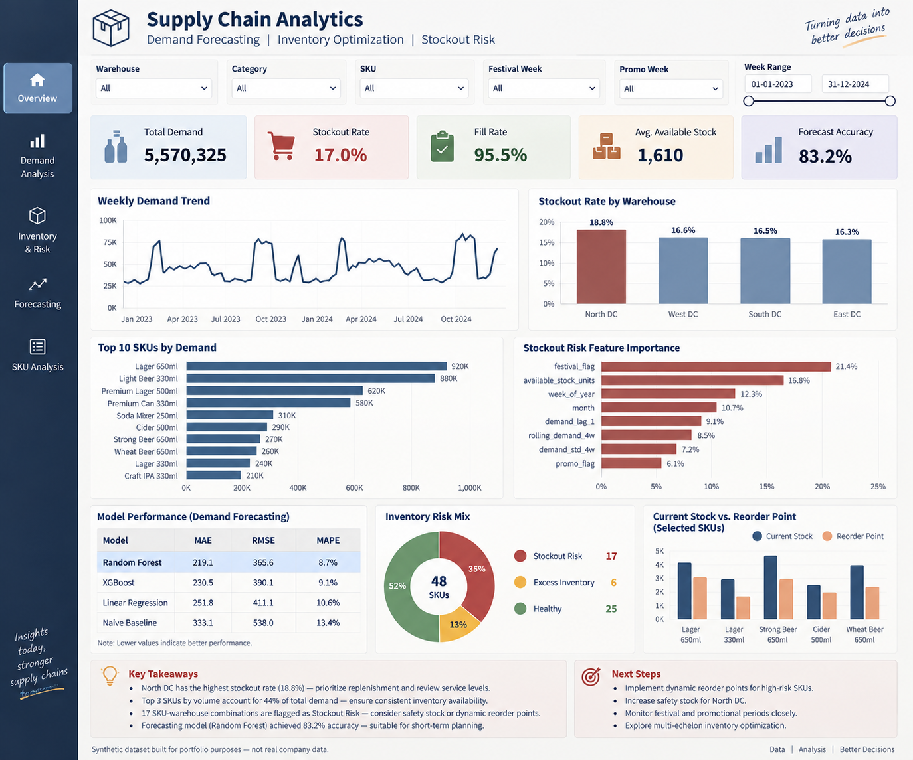

# Demand Forecasting & Inventory Risk Analytics

An end-to-end **Supply Chain Analytics** project focused on demand forecasting,
stockout-risk prediction, and inventory optimization for a simulated beverage
distribution network.

## Business Problem

The distribution network faces two competing inventory problems:

- Stockouts of high-demand SKUs, particularly at specific warehouse–SKU combinations.
- Excess inventory in lower-demand products, increasing working-capital exposure.

The objective is to use **SQL, statistical analysis, and machine learning** to
understand demand patterns, forecast requirements, identify stockout risk, and
develop practical inventory policies.

---

## Project Results

| Analysis | Result |
|---|---:|
| Dataset | **4,992 records** |
| SKUs | **12** |
| Warehouses | **4** |
| Historical period | **104 weeks** |
| Forecasting model | **Random Forest** |
| Forecast MAE | **219.15** |
| MAE improvement vs. naive baseline | **34.2%** |
| Forecast accuracy | **83.2%** |
| Stockout model | **Logistic Regression** |
| Stockout recall | **94.6%** |
| Stockout F1 score | **81.0%** |
| Stockout-risk SKU–warehouse combinations | **17** |
| Excess-inventory combinations | **6** |

---

## Dataset

The project uses a **synthetically generated FMCG beverage distribution
dataset** containing:

- 4,992 observations
- 12 beverage SKUs
- 4 warehouses
- 104 weeks of historical data
- Unit price and lead-time information
- Festival and promotion indicators
- Demand, available inventory, fulfilled units, and stockout events

The dataset is designed to reproduce realistic supply-chain planning
scenarios for portfolio and analytical development.

---

## Analytical Approach

### 1. Data Validation & Business Analysis

SQL was used to validate the dataset and analyse:

- Demand by SKU
- Demand by warehouse
- Warehouse-level stockout rates
- SKU–warehouse stockout exposure
- High-risk combinations

### 2. Exploratory Data Analysis

Python was used to examine:

- Demand trends and seasonality
- SKU-level demand concentration
- Warehouse performance
- Inventory and stockout behaviour
- Festival and promotion effects

### 3. Demand Forecasting

Multiple forecasting approaches were evaluated:

- Naive baseline
- Linear Regression
- Random Forest
- XGBoost

**Random Forest was selected as the final forecasting model**, achieving
a 34.2% reduction in MAE compared with the naive baseline.

### 4. Stockout Risk Prediction

Two classification approaches were evaluated:

- Logistic Regression
- Random Forest Classifier

Logistic Regression was selected based on F1 performance, achieving:

- **Precision:** 70.8%
- **Recall:** 94.6%
- **F1 Score:** 81.0%

The high recall is particularly relevant for inventory planning because
missing a genuine stockout-risk case can have a direct service-level impact.

### 5. Inventory Optimization

The project translates analytical outputs into inventory decisions using:

- Safety Stock
- Reorder Point
- Economic Order Quantity (EOQ)
- Current inventory vs. required inventory
- SKU–warehouse risk classification

The resulting policy identifies combinations requiring replenishment,
monitoring, or excess-inventory review.

---

## Dashboard Preview



The dashboard consolidates demand performance, warehouse stockout rates,
forecasting results, stockout-risk indicators, and inventory policy outputs
into a single decision-support view.

> **Note:** The current dashboard is a portfolio visualization/prototype.
> A native Power BI implementation is being developed separately.

---

## Repository Structure

```text
Supply-Chain-Analytics/
│
├── data/
│   └── beverage_distribution_data.csv
│
├── notebooks/
│   ├── 01_Data_Understanding.ipynb
│   ├── 02_Data_Cleaning.ipynb
│   ├── 02_Load_Data_to_MySQL.ipynb
│   └── 03_Business_EDA.ipynb
│
├── mysql/
│   └── SQL analysis and validation queries
│
├── reports/
│   ├── model_business_summary.csv
│   ├── final_regression_model_comparison.csv
│   ├── stockout_classification_model_comparison.csv
│   ├── stockout_risk_feature_importance.csv
│   ├── inventory_optimization_kpis.csv
│   └── inventory_optimization_policy.csv
│
├── images/
│   └── dashboard.png
│
├── models/
│   └── README.md
│
└── README.md
